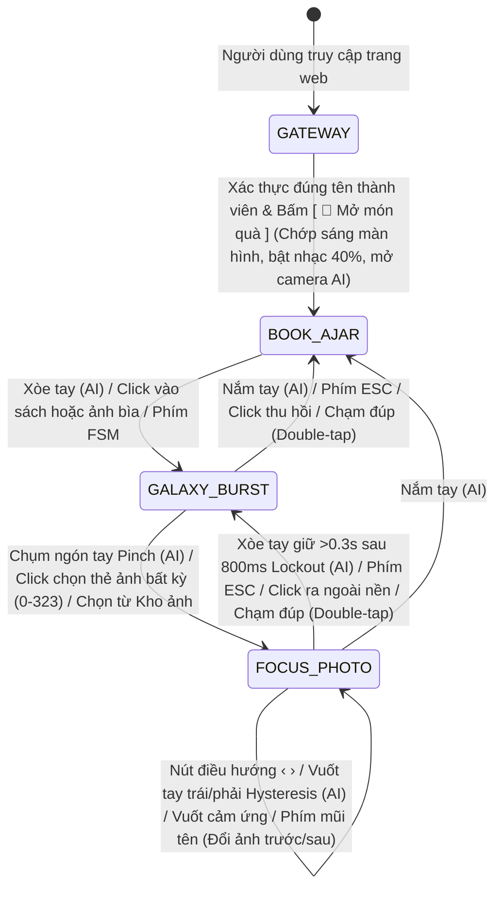

# ✨ MEMORYZONE 218 — CONTEXT.md ✨

> **Dự án:** Kỷ yếu Y khoa 3D Tương tác — Phòng Thí Nghiệm Trung Tâm (Năm 2026)  
> **Phiên bản tài liệu:** 2.4 (Chuẩn hóa Màu Sắc Ảnh Bìa, Giảm Hạt Kép GPU, Phân Cấp Tương Tác & Cử Chỉ Vuốt Tay Hysteresis - ADR 0004)  
> **Ngày cập nhật:** 22/09/2026  
> **Kiến trúc:** Single-File Web Application (HTML5 / WebGL Three.js / MediaPipe Vision AI / Web Audio / IndexedDB)  
> **Kế hoạch triển khai:** Duy trì cấu trúc Single-File độc lập, chuẩn hóa để đổi tên file chạy `batdau.html` thành `index.html` khi phát hành (GitHub Pages / Vercel).

---

## 1. MỤC ĐÍCH TRANG WEB & Ý TƯỞNG THIẾT KẾ

### 1.1. Mục Đích Dự Án
**MEMORYZONE 218** là ứng dụng web kỷ yếu số 3D (3D Digital Memory Yearbook) dành cho tập thể y bác sĩ / nghiên cứu viên Phòng thí nghiệm trung tâm (Phòng 218) năm 2026.

Mục tiêu cốt lõi của dự án:
- **Lưu giữ & Tri ân:** Số hóa và tôn vinh các khoảnh khắc kỷ niệm thanh xuân (số lượng linh hoạt / chưa cố định theo dữ liệu thực tế) bằng không gian 3D WebGL: Cuốn sách bìa cẩm thạch ngọc bích, khối tinh cầu ngân hà 41,400 hạt stardust phát quang, 8 đạo cụ y khoa chibi, 3 trái tim kim cương và 75 ngôi sao quang học.
- **Trải nghiệm thị giác trình diễn (Showcase-Level Visual Experience):** Kết hợp đồ họa 3D thời gian thực (WebGL), hiệu ứng tinh vân phát quang (Bloom Stardust), tạo hình nghệ thuật (cuốn sách bìa cẩm thạch ngọc bích, khối tinh cầu thiên hà, các mô hình đạo cụ y khoa chibi).
- **Tương tác đa phương thức tân tiến:** Cho phép người dùng trải nghiệm bằng chuột & bàn phím (Desktop), thao tác chạm & vuốt cảm ứng đa điểm mượt mà (Mobile), và điều khiển chuyển động không chạm thông qua **Camera AI nhận diện khớp xương bàn tay (MediaPipe Hand Tracking)**.
- **Cá nhân hóa & Tính riêng tư:** Tích hợp Cổng bảo mật Tinh hà (Cinematic Security Gateway) với whitelist tên thành viên, hiển thị lời chào mừng cá nhân hóa trước khi mở album.

### 1.2. Định Hướng Kiến Trúc & Triển Khai
- **Triết lý Single-File nguyên bản:** Toàn bộ HTML, CSS, JavaScript, WebGL Shaders, Audio Engine và AI Logic được đóng gói tập trung trong một file duy nhất (`batdau.html`). Không sử dụng công cụ đóng gói (no Webpack/Vite), không framework cồng kềnh, nạp module độc lập qua `<script type="importmap">`.
- **Định hướng phát hành (Deployment Target):** File chạy hiện tại mang tên `batdau.html` (đóng vai trò nguồn phát triển chính), được định hướng sẵn sàng đổi tên thành `index.html` khi triển khai lên các dịch vụ máy chủ tĩnh (GitHub Pages, Vercel, Netlify, Cloudflare Pages).

---

## 2. LUỒNG TRẢI NGHIỆM NGƯỜI DÙNG (EXPERIENCE FLOW & FSM)

Toàn bộ ứng dụng được điều phối bởi một Bộ điều khiển trạng thái hữu hạn (**Finite State Machine - FSM**) gồm 3 trạng thái chuyển động chính kết hợp với Cổng bảo mật ban đầu:

### Chi Tiết Từng Giai Đoạn & Trạng Thái:

1. **Cổng Bảo Mật Tinh Hà (Cinematic Security Gateway):**
   - **Giai đoạn 1 (Loading):** Màn hình nền tinh vân mây xoay chuyển, hiển thị hiệu ứng *"Đang lấy hồi ức..."* trong lúc nạp danh mục ảnh, khởi tạo IndexedDB và kích hoạt tiền biên dịch GPU (`renderer.compile`).
   - **Giai đoạn 2 (Xác thực):** Ô nhập tên *"Xin chào bạn đến với nơi lưu giữ kỉ niệm, bạn là ..... ?"*. Hệ thống so khớp Unicode (NFC không phân biệt hoa thường) với danh sách whitelist 21 tên thành viên (Ngọc Diệu, Minh Anh, Hương Giang, Quang Thanh, Phương Anh, Phanh, Phương Loan, Loan, Diệu, Giang, Anh, Hùng, Kim Luyên, Luyên, Bích Ngọc, Ngọc, Mai Thu, Thu, Nhi, Cô Hồng, Cô Dịu). Nhập sai rung lắc báo đỏ; nhập đúng hiện lời chào cá nhân hóa *"Xin chào [Tên], chào mừng trở về nhà ❤️"* với hiệu ứng popup 0.9s mượt mà và sắc xanh ngọc Celestial Cyan.
   - **Giai đoạn 3 (Khởi chạy):** Bấm nút `[ 🎁 Mở món quà ]` kích hoạt hiệu ứng chớp sáng trắng bừng nở (Screen Flash), tự động phát nhạc BGM bài số 1 ở âm lượng chuẩn 40%, máy tính tự động bật Camera AI (mobile mặc định tắt), làm mờ hòa tan lớp phủ bảo mật để bước vào không gian 3D.

2. **Trạng Thái 1 — Sách Mở Hờ (`BOOK_AJAR`):**
   - Cuốn sách kỷ yếu 3D đứng dọc trang nhã, mở hờ góc 30°, xoay chậm quanh chính tâm cuốn sách.
   - Lòng sách phát sáng ấm áp, 6 trang sách rực rỡ tượng trưng cho các chủ đề khác nhau, duy trì **100% mật độ 41,400 hạt stardust phát quang** tạo cảm giác lung linh bề thế.
   - 8 bức ảnh bìa nghệ thuật gắn phẳng sát mặt cẩm thạch ngọc bích sử dụng vật liệu `MeshBasicMaterial` màu sắc trung thực không viền dây chữ nhật, bảo toàn 100% màu áo hồng và sắc da tự nhiên.
   - Tiêu đề bìa trước "MEMORYZONE 218" mở rộng 20% phát quang nổi khối trang trọng.
   - 8 đạo cụ y khoa chibi gắn trang trí trên bìa sách (ống nghe, áo blouse, giá ống nghiệm, kính hiển vi, kính lúp, sổ tay).
   - 316 bức ảnh kỷ niệm còn lại thu nhỏ thành các đốm sáng phát quang (**Glow Orbs / Stardust**) bay lơ lửng theo quỹ đạo hình cầu Fibonacci quanh sách, tuyệt đối không va chạm mép sách.
   - 3 trái tim kim cương vát cạnh (Diamond Crystal Hearts) và 75 ngôi sao đa cánh phát quang (Iridescent Stars) bay quanh như các tiểu hành tinh.
   - Cự ly camera tự động kéo gần ấm áp (`targetCameraDistance = 18.5`).
   - **Phân cấp tương tác chuẩn mực (ADR 0004):** Bấm chuột hoặc chạm vào bất kỳ điểm nào (kể cả ảnh bìa hay thân sách) đều kích hoạt mở bung ngân hà (`GALAXY_BURST`) trước tiên.

3. **Trạng Thái 2 — Tinh Cầu Ngân Hà Bung Mở (`GALAXY_BURST`):**
   - Chuyển động **3 trong 1 đồng thời**: Cuốn sách mở bung hoàn toàn 160°, thân sách hòa tan mờ dần, toàn bộ hạt stardust bừng nổ chấn động và định hình thành khối tinh cầu ngân hà 360°.
   - **Cơ chế giảm hạt kép GPU (Dual-Phase GPU Stardust Attenuation - ADR 0004):** Tự động làm mờ và thu nhỏ 30% số hạt (12,420 hạt) trên shader GPU, đưa mật độ hoạt động về 70% (**28,980 hạt**), tạo không gian tinh cầu thoáng đãng tôn vinh 324 thẻ ảnh.
   - 324 khung ảnh kỷ niệm bung tỏa theo phân bố mặt cầu Fibonacci 360° đa tầng hữu cơ ($R \in [11.5, 17.0]$), quay nhào lộn ngẫu nhiên tự do (Full Free Tumbling), mặt sau phản chiếu ánh sáng môi trường giả lập chất liệu gương bạc lỏng (Liquid Silver Chrome).
   - Dải ngân hà xích đạo trên skydome được làm dịu 40% (alpha 0.60x) và giảm chớp sao xuống 180 tia, loại bỏ hoàn toàn hiện tượng chói mắt.
   - Camera tự động lùi xa thêm 50% (`targetCameraDistance = 37.0`) giúp mở rộng tầm nhìn toàn cảnh.
   - Toàn bộ tinh cầu và thẻ ảnh quay đồng bộ 100% (Lockstep Rotation) khi người dùng tương tác.
   - Bấm hoặc chụm ngón tay (Pinch) vào bất kỳ thẻ ảnh nào trong 324 thẻ (bao gồm 8 thẻ bìa) đều chuyển vào `FOCUS_PHOTO`.

4. **Trạng Thái 3 — Chiêm Ngưỡng Chi Tiết Ảnh (`FOCUS_PHOTO` / Hero Focus):**
   - Bức ảnh được chọn (qua click chuột, chạm cảm ứng, hoặc cử chỉ chụm tay Pinch) bay lướt mượt mà ra trước mắt camera (`scale: 1.35x`, cự ly `targetCameraDistance = 22.0`).
   - Cường độ Bloom tự động hạ thấp (`targetFocusDim = 0.60`) chống lóa mắt, bảo đảm màu sắc và độ sắc nét chân thực của ảnh.
   - Các hạt tinh hà xung quanh dịu sáng, tạo nền sâu thẳm tôn vinh khoảnh khắc kỷ niệm.
   - **Khóa trễ thả ngón 800ms (Pinch Release Lockout - ADR 0004):** Chặn hoàn toàn cử chỉ xòe tay trong 800ms đầu tiên sau khi bắt ảnh, giúp người dùng thả lỏng tay tự nhiên mà không sợ văng ảnh.
   - **Cử chỉ vuốt tay ngang Hysteresis (ADR 0004):** Vuốt nhanh sang trái để xem ảnh tiếp theo, vuốt nhanh sang phải để xem ảnh trước đó; khóa trễ hồi vị 800ms loại bỏ hoàn toàn chuyển động thu tay về tâm gây trượt ngược.
   - **Cử chỉ thoát an toàn:** Xòe tay giữ liên tục >0.3s để quay lại ngân hà (`🖐️ XÒE TAY: BUNG / THOÁT NGÂN HÀ`); Nắm tay bất kỳ lúc nào để thu về sách (`✊ NẮM TAY: THU VỀ SÁCH`).
   - **Điều hướng Chuột & Cảm ứng Đa Năng:** Hai nút mũi tên phát quang neon cyan (`‹` và `›`) tự động hiện êm ái ở hai mép màn hình cho người dùng chuột/cảm ứng; tự động khóa xoay camera (`controls.enableRotate = false`) trong `FOCUS_PHOTO` để thao tác vuốt đổi ảnh không làm xoay lệch không gian 3D; hỗ trợ chạm đúp (Double-tap) chuyển trạng thái mượt mà.
   - Hỗ trợ đổi ảnh tiếp theo/trước đó qua nút mũi tên trên màn hình, phím mũi tên bàn phím, vuốt cảm ứng hoặc giơ ngón tay điều khiển.

---

## 3. CÔNG NGHỆ, THƯ VIỆN & CÔNG CỤ SỬ DỤNG (TECH STACK)

| Nhóm Công Nghệ | Tên Thư Viện / Công Cụ | Phiên Bản | Vai Trò & Chức Năng Cụ Thể |
|---|---|:---:|---|
| **Kiến trúc ứng dụng** | **Single-File Web App (SPA)** | HTML5 / ES6 | Đóng gói trọn vẹn trong 1 file HTML duy nhất; nạp module qua `<script type="importmap">`, chạy trực tiếp trên trình duyệt mà không cần bước build phức tạp. |
| **Đồ họa 3D WebGL** | **Three.js** | `r160` | Khởi tạo Scene, PerspectiveCamera, WebGLRenderer (ACESFilmicToneMapping, exposure 1.35), xây dựng khối hình 3D, hệ thống chiếu sáng Studio Lighting. |
| **Điều khiển Camera** | **three/addons/controls/OrbitControls.js** | `r160` | Điều khiển xoay, lướt và thu phóng góc nhìn không gian 3D bằng chuột và cử chỉ cảm ứng với giảm chấn mượt mà (damping factor: 0.05). |
| **Hậu kỳ thị giác (Post-processing)** | **three/addons/postprocessing/** | `r160` | Pipeline xử lý đồ họa: `EffectComposer`, `RenderPass`, `UnrealBloomPass` (tạo quầng sáng rực rỡ neon cho hạt và tinh vân), `OutputPass`. |
| **Tập lệnh Shader Tùy biến** | **GLSL Custom Shaders** | WebGL GLSL | • `morphShaderMat`: Biến đổi vị trí 41,400 hạt tức thời giữa sách đóng, bung nổ và tinh cầu 360°; tích hợp cơ chế giảm hạt kép GPU (`attenuate` attribute) tự động làm mờ và thu nhỏ 30% số hạt trong ngân hà. • `flareShaderMat`: Shader tạo 180 ngôi sao lóe sáng chữ thập (cross-flares) nhấp nháy quang học. |
| **Thị giác máy tính AI** | **@mediapipe/tasks-vision** | `0.10.9` | Nạp mô hình `hand_landmarker.task` qua WebAssembly (WASM) với GPU delegate; vận hành luồng độc lập 25–30 FPS (`requestVideoFrameCallback`) tách rời khỏi Three.js 60 FPS; nhận diện 21 khớp ngón tay chuẩn hóa theo chiều dài lòng bàn tay $L_{\text{palm}}$ và góc đốt ngón tay tương đối. |
| **Lưu trữ cục bộ** | **IndexedDB API** | `v1` | Database `MemoryZone218_DB`, bảng `photos`: Lưu trữ bền vững các ảnh người dùng tải thêm từ thiết bị mà không cần máy chủ backend. |
| **Âm thanh nền** | **HTML5 Audio API** | Native | Trình phát danh sách 8 bài hát MP3 thanh xuân, điều chỉnh âm lượng, hiệu ứng đĩa than quay vinyl và dòng chữ chạy ticker. |
| **Giao diện & Phông chữ** | **Google Fonts & Modern CSS** | CSS3 / Glassmorphism | Phông chữ `Fredoka` (phong cách Pop Chibi) và `Montserrat` (hiện đại, trang trọng); hiệu ứng kính mờ `backdrop-filter: blur`, viền neon phát quang, Responsive Mobile/PC. |

---

## 4. DANH SÁCH CÁC FILE CHÍNH VÀ VAI TRÒ CỤ THỂ

### 4.1. Mã Nguồn Ứng Dụng Web & Thư Mục Phiên Bản

- **`batdau.html`** / **`index.html`**:  
  **Vai trò:** File chạy hoàn chỉnh, duy nhất và ổn định của toàn bộ dự án (Single-File Architecture, ~4,042 dòng).  
  - Tích hợp HTML Structure, CSS Stylesheet (Glassmorphism UI, Responsive Mobile/PC, PIP HUD, Modals, Dev Tools).
  - Khởi tạo Three.js Scene, Hệ thống hạt Morphing (41,400 hạt), Mô hình Cuốn sách 3D cẩm thạch ngọc bích, 3 Trái tim kim cương, 75 Ngôi sao phát quang, 8 ảnh bìa và 8 đạo cụ y khoa chibi.
  - Tích hợp MediaPipe HandLandmarker nhận diện 21 khớp xương, thuật toán Hand Steering và nhận diện cử chỉ (Pinch bắt ảnh, Xòe tay bung galaxy, Nắm tay thu về sách, Vuốt tay / Giơ ngón đổi ảnh).
  - Trình quản lý FSM 3 trạng thái, Cổng bảo mật Tinh hà có xác thực tên, Widget BGM 8 bài hát, Kho ảnh Modal và Bảng Dev Tools (`Shift + D`).
  - *(Kế hoạch)*: Sẵn sàng đổi tên thành **`index.html`** khi đưa lên môi trường hosting production.

- **`version_web/`**:  
  **Vai trò:** Thư mục lưu trữ các bản sao lưu tự động (auto-backup) của file mã nguồn (`index.html`, `batdau.html` hoặc các file code vừa chỉnh sửa) sau mỗi lần implement thành công có thay đổi mã nguồn.

### 4.2. Thư Mục Tài Nguyên Đa Phương Tiện (`assets/`)

- **`assets/photos_manifest.json`**:  
  **Vai trò:** Danh mục siêu dữ liệu (metadata catalog) của 324 bức ảnh kỷ niệm. Mỗi phần tử cấu hình:
  - `id`: Mã định danh ảnh (0 – 323).
  - `url`: Đường dẫn tài nguyên hiển thị (`assets/web_photos/photo_XXX.jpg`).
  - `title`: Tiêu đề chú thích ảnh (ví dụ: *"Kỷ niệm #1"*).
  - `color`: Mã màu chủ đạo (dominant hex color) dùng để phát sáng đốm Stardust và viền neon.
  - `aspect`: Tỉ lệ khung hình (width/height) giúp dựng thẻ ảnh không bao giờ bị méo hình.

- **`assets/images/`**:  
  **Vai trò:** Kho lưu trữ tài nguyên gốc gồm 292 tệp media chụp thực tế của tập thể lớp (ảnh JPG, PNG, định dạng iPhone HEIC, video MP4, MOV).

- **`assets/musics/`**:  
  **Vai trò:** Kho lưu trữ 8 bài hát thanh xuân (định dạng MP3) làm nhạc nền BGM:
  1. *Aloniss - Press The Pause Button And You Will Be Awake And Fallen* (Mặc định)
  2. *Có Hẹn Với Thanh Xuân - MONSTAR*
  3. *Falling You*
  4. *Hạ Chí Chưa Tới (Piano Version)*
  5. *Nhớ Mãi Chuyến Đi Này*
  6. *Nơi Pháo Hoa Rực Rỡ - Orange x Hoàng Dũng*
  7. *Thanh Xuân Của Chúng Ta - Bùi Anh Tuấn ft. Bảo Anh*
  8. *Chuyến Tàu Của Thanh Xuân - Xuân Định K.Y*

- **`assets/web_photos/`**:  
  **Vai trò:** Thư mục chứa các ảnh đã tối ưu hóa cho web (chứa `photo_008.jpg`...). Các ảnh chưa có file vật lý trên đĩa sẽ được tự động hiển thị mượt mà thông qua cơ chế Canvas Texture Fallback với gradient đa sắc sang trọng.

- **`assets/building/` & `assets/videos/`**:  
  **Vai trò:** Các thư mục đệm lưu trữ tài liệu liên quan (`a.docx`).

### 4.3. Tài Liệu Hướng Dẫn & Cấu Hình Agent

- **`CONTEXT.md`** *(File này)*:  
  **Vai trò:** Tài liệu ngữ cảnh chuẩn của kho mã nguồn, là nguồn chân lý (Source of Truth) mô tả mục đích, công nghệ, danh sách file, kiến trúc FSM, các đặc trưng kỹ thuật và bảng thuật ngữ nghiệp vụ.

- **`AGENTS.md`**:  
  **Vai trò:** Quy tắc chỉ dẫn dành cho các Agent AI khi làm việc trong kho lưu trữ (chỉ định cấu trúc Domain Docs đơn ngữ cảnh và Issue Tracker cục bộ).

- **`docs/html-audit-history.md`**:  
  **Vai trò:** Bảng đối chiếu tiến trình lịch sử 10 mốc phiên bản HTML của dự án từ 17/09 đến 19/09/2026, ghi nhận chi tiết từng bước tối ưu hóa, các yêu cầu của người dùng và các bài học kỹ thuật rút ra.

- **`docs/agents/`**:  
  - `issue-tracker.md`: Hướng dẫn quản lý công việc, spec và ticket qua thư mục `.scratch/`.
  - `domain.md`: Hướng dẫn đọc hiểu ngữ cảnh nghiệp vụ và quy ước từ vựng.
  - `triage-labels.md`: Bảng quy ước 5 nhãn phân loại công việc tiêu chuẩn.

- **`docs/adr/`**:  
  **Vai trò:** Thư mục lưu trữ các bản ghi quyết định kiến trúc (Architecture Decision Records).

- **`skills-lock.json`**:  
  **Vai trò:** Tệp khóa xác thực tính toàn vẹn (integrity hash) của 7 agent skills thuộc nguồn `mattpocock/skills`.

- **`.scratch/`**:  
  **Vai trò:** Thư mục chứa các file đặc tả (`spec.md`) và ticket bóc tách (`issues/`) khi triển khai tính năng mới theo quy trình của Matt Pocock.

---

## 5. CÁC ĐẶC TRƯNG KỸ THUẬT NỔI BẬT

### 5.1. Hệ Thống Hạt Tinh Thể Khổng Lồ & Cơ Chế Giảm Hạt Kép GPU (Dual-Phase GPU Attenuation)
- Gồm **41,400 hạt stardust phát quang** duy trì 100% độ sáng trong trạng thái Sách Mở Hờ (`BOOK_AJAR`) gồm 5,400 hạt nền và 36,000 hạt của 6 tầng trang sách đa sắc: Cyan, Hồng neon, Vàng kim, Tím thạch anh, Xanh ngọc, Cam san hô.
- **Cơ chế giảm hạt kép GPU (Dual-Phase GPU Stardust Attenuation - ADR 0004):** Trong trạng thái `GALAXY_BURST`, shader tự động làm mờ và thu nhỏ 30% số hạt (12,420 hạt) thông qua biến `attenuate` và `uGalaxyRatio`, đưa mật độ hoạt động về 70% (**28,980 hạt**). Kết hợp lệnh `discard` sớm trong Fragment Shader giúp loại bỏ triệt để overhead rasterization, giữ không gian tinh cầu thoáng đãng và bảo tồn 60 FPS.
- Phân bổ khối cầu đặc 360° theo quy luật mật độ giảm dần theo bán kính ($R \in [1.5, 17.0]$): đậm đặc và hạt to ($1.7x$) tại lõi trung tâm ($R \in [1.5, 6.0]$), thưa dần và nhỏ ($0.7x$) ra đến biên ngoài ($R \in [6.0, 17.0]$), đan xen mềm mại cùng 324 thẻ ảnh mà không làm che khuất mặt ảnh.
- Cơ chế **Zero-Allocation & GPU Pre-warming**: Sử dụng một `BufferGeometry` và một `Points` duy nhất (`masterParticleMesh`), cập nhật vị trí tức thời trên GPU qua GLSL Vertex Shader `mix()`, biên dịch trước qua `renderer.compile()` lúc nạp trang, đảm bảo 60 FPS mượt mà tuyệt đối trên thiết bị di động (iPhone 12 / Apple A14 Bionic).

### 5.2. Công Nghệ Nhận Diện Cử Chỉ Bàn Tay MediaPipe Độc Lập & Vuốt Tay Hysteresis (AI HUD)
- **Tách luồng AI 25–30 FPS (Decoupled 60 FPS AI Pipeline - ADR 0004):** Tách hàm `detectForVideo()` ra khỏi vòng lặp Three.js `animate()`, chạy độc lập qua `requestVideoFrameCallback` với nhịp điều tiết 25–30 FPS (~33ms), giải phóng chu kỳ render Three.js đạt 60 FPS mượt mà tuyệt đối.
- **Thước đo bất biến theo lòng bàn tay (Scale-Invariant Palm Metric - ADR 0004):** Chuẩn hóa mọi khoảng cách nhận diện theo chiều dài lòng bàn tay $L_{\text{palm}} = \text{hypot}(\text{wrist.x} - \text{middleMCP.x}, \text{wrist.y} - \text{middleMCP.y})$ và đánh giá độ gập duỗi qua góc đốt ngón tay tương đối $\cos \theta$. Cử chỉ nhận diện ổn định tuyệt đối từ khoảng cách gần (0.60x) đến xa (0.15x) và không bị ảnh hưởng bởi góc nghiêng bàn tay.
- **Khóa trễ thả ngón 800ms (Pinch Release Lockout - ADR 0004):** Khi bắt ảnh vào `FOCUS_PHOTO`, kích hoạt khóa trễ 800ms vô hiệu hóa cử chỉ Xòe tay, cho phép người dùng thả lỏng ngón tay tự nhiên mà không sợ bị văng ảnh về ngân hà.
- **Điều hướng vuốt ngang Hysteresis (Hysteretic Horizontal Swipe - ADR 0004):** Vuốt tay nhanh sang trái ($v_x < -0.70$) để chuyển ảnh tiếp theo, vuốt sang phải ($v_x > +0.70$) để chuyển ảnh trước đó. Khóa trễ hồi vị 800ms loại bỏ chuyển động thu tay về tâm, triệt tiêu hoàn toàn hiện tượng trượt ngược ảnh.
- **Cử chỉ thoát có chủ ý & Nắm tay thu hồi:** Xòe tay giữ liên tục >0.3s để thoát về `GALAXY_BURST`; Nắm tay lập tức thu hồi toàn bộ album về `BOOK_AJAR`.
- **Huy hiệu Neon HUD tương tác:** Hiển thị tức thời trên `#cam-wrapper` các huy hiệu phát quang `👈 VUỐT PHẢI: ẢNH TRƯỚC`, `👉 VUỐT TRÁI: ẢNH TIẾP`, `🖐️ XÒE TAY: BUNG / THOÁT NGÂN HÀ`, `✊ NẮM TAY: THU VỀ SÁCH`.
- **Hand Steering**: Lấy tọa độ khớp giữa bàn tay `middleMCP` chuẩn hóa `[-1, 1]`, tạo lực quay góc nhìn không gian 3D mượt mà tựa như đang lái tàu vũ trụ giữa ngân hà.
- **Screen-Space Raycasting Photo Grab**: Khi chụm ngón tay (Pinch), tính khoảng cách 2D trên màn hình từ tâm ngón tay tới hình chiếu của 324 thẻ ảnh, tự động hút bức ảnh gần nhất về trước mắt người dùng.

### 5.3. Chất Liệu Ảnh Bìa Màu Sắc Trung Thực, Gương Bạc Lỏng & Tỉ Lệ Khung Hình Chuẩn Xác
- **Vật liệu màu sắc trung thực (Unlit Color Fidelity Material - ADR 0004):** 8 thẻ ảnh bìa chuyển sang `MeshBasicMaterial` không chịu tác động của ánh sáng môi trường hay phản xạ phát quang cyan, bảo toàn 100% màu áo hồng, sắc da tự nhiên và độ tương phản của ảnh gốc `assets/Cover/`.
- **Loại bỏ khung dây viền hộp chữ nhật (ADR 0004):** Gỡ bỏ hoàn toàn `EdgesGeometry` khỏi các thẻ ảnh bìa, giúp các nhãn dán sticker tinh thể trong suốt hòa quyện tinh tế và tự nhiên.
- **Tiêu đề Bìa Trước phát quang nổi bật (ADR 0004):** Tiêu đề "MEMORYZONE 218" được mở rộng 20% lên `PlaneGeometry(4.10, 1.45)` tại $y = 2.35$, tăng `emissiveIntensity = 0.75` với viền trắng nổi khối trang trọng.
- Mặt sau của 324 thẻ ảnh sử dụng vật liệu `MeshPhysicalMaterial` kim loại phản chiếu (`metalness: 0.98, roughness: 0.03, clearcoat: 1.0`), mang lại hiệu ứng gương bạc lỏng sang trọng khi các thẻ ảnh nhào lộn xoay quanh trục.
- Tỉ lệ của từng tấm ảnh được tính toán tự động dựa trên trường `aspect` trong `photos_manifest.json` nhằm đảm bảo ảnh dọc (3:4) và ảnh ngang (4:3) đều giữ nguyên tỷ lệ gốc, không bị biến dạng.
- **Canvas Texture Fallback:** Hàm `createFramelessPhotoTexture` tự động vẽ các tấm thẻ phong cách typography neon sang trọng cho từng kỷ niệm nếu ảnh vật lý chưa sẵn sàng trên đĩa.

### 5.4. Các Tiện Ích Trải Nghiệm & Dev Tools
- **Zen Mode (Toàn màn hình):** Bấm phím hoặc nút Zen Mode sẽ ẩn 100% giao diện điều khiển (UI), chỉ giữ lại không gian 3D tinh cầu thuần khiết.
- **Dev Tools Ẩn (`Shift + D`):** Cung cấp bảng điều khiển chuyên sâu cho phép tinh chỉnh số lượng hạt ngân hà, hạt trang sách, kích thước sao, bảng màu hạt và tải thêm tài nguyên trực tiếp.
- **Modal Hướng Dẫn:** Phân tách rõ ràng hướng dẫn thao tác cảm ứng cho điện thoại và thao tác chuột/phím/AI cho máy tính.

---

## 6. BẢNG THUẬT NGỮ CHUẨN CỦA DỰ ÁN (GLOSSARY)

| Thuật Ngữ | Định Nghĩa Trong Hệ Thống |
|---|---|
| **Book Ajar** | Trạng thái mở hờ của cuốn sách 3D (~30 độ), sách xoay quanh tâm, lòng sách phát sáng, ảnh lơ lửng ở dạng đốm sáng nhỏ. |
| **Galaxy Burst** | Trạng thái bung mở ngân hà 3 trong 1 (mở 160°, bừng sáng chấn động, tạo tinh cầu hạt đặc 360° với 324 thẻ ảnh nhào lộn). |
| **Hero Focus** | Chế độ phóng to chiêm ngưỡng một bức ảnh cận cảnh trước camera, tự động hạ bloom chống lóa và làm dịu hạt nền. |
| **Hand Steering** | Kỹ thuật điều hướng góc nhìn và trục xoay không gian 3D dựa trên độ lệch tâm tọa độ bàn tay từ MediaPipe AI. |
| **Glow Orb / Stardust** | Đốm sáng cầu phát quang đại diện cho từng bức ảnh khi ở trạng thái sách mở hờ, lấy theo mã màu chủ đạo của ảnh. |
| **Liquid Silver Chrome** | Vật liệu gương bạc lỏng giả lập kim loại bóng loáng phản xạ ánh sáng môi trường ở mặt sau các thẻ ảnh (`metalness: 0.9, roughness: 0.1, clearcoat: 1.0, envMapIntensity` cao cấp). |
| **Volumetric Stardust Crystal Orb** | Khối cầu pha lê tinh vân 3D đặc quánh được định hình chủ đạo bởi 41,400 hạt stardust phân bổ thể tích đồng nhất ($r = 14.5 \cdot \sqrt[3]{rand}$), chứa đựng 255 thẻ ảnh thật với 75% lơ lửng đa tầng trong lòng khối cầu và 25% nổi trên bề mặt, xoay bồng bềnh chậm rãi. |
| **Anti-Collision Volumetric Layout** | Thuật toán phân bổ thể tích có kiểm tra khoảng cách tối thiểu ($d_{min} \ge 1.4$) cho các thẻ ảnh lơ lửng, triệt tiêu hoàn toàn hiện tượng chồng đè hay đâm xuyên mặt ảnh, kết hợp thu nhỏ nhẹ thẻ trong lòng ($0.80x$) và giữ nguyên thẻ bề mặt ($1.0x$). |
| **255 Real Web-Optimized Photos** | Hệ thống ảnh kỷ niệm thật được xử lý từ 255 file gốc (JPG, PNG, HEIC) sang chuẩn web JPEG cạnh tối đa 720px (82% quality, dung lượng 40-65KB/ảnh), bảo toàn nguyên vẹn 100% tỉ lệ khung hình gốc và siêu nét trên cả PC lẫn iPhone 12. |
| **Dynamic Photo Management** | Tính năng thêm ảnh mới và xóa ảnh (kèm lưu danh sách đen blacklist vào localStorage/IndexedDB) hoạt động trực tiếp trong Kho ảnh và DevTools, tự động gỡ bỏ/thêm mới thẻ 3D và tái cân bằng không gian khối cầu tức thời. |
| **GPU Pre-warming Pipeline** | Quy trình gọi `renderer.compile(scene, camera)` ngay trong màn hình Cổng Bảo Mật (Gateway), nạp sẵn 100% shader và kết cấu thẻ ảnh vào VRAM của GPU (chuẩn hóa trên iPhone 12 / A14 Bionic), triệt tiêu hoàn toàn hiện tượng giật khựng khung hình khi chuyển cảnh (ADR 0003). |
| **Vibrant Nebula Skydome** | Vòm trời vũ trụ 3D 360° đa sắc mô phỏng dải ngân hà đá quý (Cosmic Jewel), chuyển từ đen kịt sang dải mây loang đa tầng (Cyan, Hồng neon, Tím, Vàng hổ phách), cung cấp ánh sáng môi trường rực rỡ và phản chiếu lung linh trên thẻ ảnh. |
| **Stationary Celestial Skydome** | Vòm trời sao vũ trụ 360° được cố định tuyệt đối ở tọa độ thế giới `[0, 0, 0]` trong vòng lặp `animate()`, ngắt hoàn toàn tỉ lệ xoay phụ thuộc `0.4x` với album. Cuốn sách và 324 thẻ ảnh xoay tự do bên trong hệ tọa độ vũ trụ tĩnh, loại bỏ hoàn toàn cảm giác mỏi mắt và mang lại cảm giác không gian bao la tĩnh lặng (ADR 0002). |
| **5% Feathered Dark Boundary Rift** | Hai vành đai rãnh tối phân cách chuẩn xác rộng đúng 5% chiều cao canvas (`27% - 32%` ở cực Bắc và `68% - 73%` ở cực Nam), lõi đen tuyền `#020308`, biên độ loang mềm tự nhiên `1.2% - 1.5%` từ hai mép, điểm xuyết 52 sao vi mô mờ (`alpha 0.20 - 0.35`), tạo chiều sâu tương phản cho dải ngân hà xích đạo. |
| **4K Ultra-HD Equirectangular Texture** | Kết cấu vòm trời vẽ thủ tục (procedural canvas) độ phân giải siêu nét `4096 x 2048` kết hợp lưới hình cầu `SphereGeometry(400, 120, 80)` khử hoàn toàn hiện tượng gãy khúc đa giác và mờ vỡ điểm ảnh trên màn hình Retina/4K. |
| **Expanded Dual Polar Vortex with +50% Twinkling Stars** | Cấu trúc xoáy cực Bắc (`0% - 27%`) và cực Nam (`73% - 100%`) mở rộng biên độ lên 27% chiều cao canvas (`VORTEX_HEIGHT = Math.round(H * 0.27)`), giữ nguyên 5 nhánh xoáy ánh sáng ngũ sắc jewel-tone, tăng cường +50% mật độ sao nền (750 sao mỗi cực, 5,250 sao xích đạo) và +50% sao phát sáng quang học tỏa tia lóe chữ thập (30 sao/9 tia ở mỗi cực, 120 sao/38 tia ở xích đạo). |
| **Coupled Multi-Tier Rotation (Legacy)** | *(Cơ chế cũ - đã thay thế bởi ADR 0002)* Từng liên kết vòm trời xoay theo tỉ lệ giảm chấn 0.4x; nay đã được tách rời độc lập để vòm trời đứng yên hoàn toàn. |
| **Artistic Crystal Cover Cards** | Bộ 8 thẻ ảnh bìa nghệ thuật chuyên biệt được nạp trực tiếp từ thư mục `assets/Cover/` (`1.png` đến `8.png`), sở hữu khung viền tinh thể pha lê phát quang neon và kênh alpha trong suốt được cắt ôm khít hình học (Auto-crop BBox). |
| **Top-Title Magazine Cover Layout** | Bố cục Bìa Trước với Tiêu đề "MEMORYZONE 218" thu gọn đặt trang trọng ở đỉnh ($y = 2.25$), phân bổ 4 ảnh ở thân và đáy bìa (Ảnh 1 dọc, Ảnh 2 vuông, Ảnh 3 dọc, Ảnh 4 ngang) với độ nghiêng vi mô $\pm 1.5^\circ$. |
| **Sandwich Layered Cover Layout** | Bố cục Bìa Sau dạng kẹp 3 tầng đối xứng hoàn mỹ gồm Banner đỉnh (Ảnh 5 ngang), Tầng giữa song song (Ảnh 7 dọc và Ảnh 6 vuông), và Banner đáy (Ảnh 8 ngang). |
| **Flat Sticker Cover Attachment** | Kỹ thuật gắn ảnh phẳng dính sát bề mặt đá cẩm thạch ngọc bích ($\Delta z = 0.002$), hòa quyện viền phát quang không khe hở và hiển thị hai mặt (Double-sided) khi bung nở vào không gian ngân hà 3D. |
| **Chibi Medical Props** | 8 mô hình 3D đạo cụ y khoa cách điệu (ống nghe, áo blouse, giá ống nghiệm, kính hiển vi, kính lúp, sổ tay); được tạm thời tách khỏi bìa sách trong giai đoạn căn chỉnh 8 ảnh bìa và sẽ tái bố trí vào các khoảng trống phù hợp. |
| **Security Gateway** | Lớp phủ bảo mật tinh hà yêu cầu người dùng nhập đúng tên thành viên lớp để mở khóa album và kích hoạt âm thanh/AI. |
| **Photos Manifest** | File JSON cấu hình danh mục 324 bức ảnh (ID, URL, màu chủ đạo, tỉ lệ khung hình). |
| **Zen Mode** | Chế độ toàn màn hình loại bỏ 100% giao diện điều khiển (UI), chỉ giữ lại không gian 3D tinh cầu thuần khiết. |
| **Zero-Allocation** | Nguyên tắc thiết kế không cấp phát bộ nhớ mới (`new Vector3`, `new Matrix4`) trong vòng lặp `animate()`, tái sử dụng Scratch Objects để đạt 60 FPS ổn định. |
| **Unlit Color Fidelity Material** | Vật liệu `MeshBasicMaterial` không chịu tác động của ánh sáng nhân tạo trong scene, loại bỏ hoàn toàn ánh phản xạ phát quang cyan, bảo toàn 100% màu áo hồng, sắc da tự nhiên và độ tương phản của 8 ảnh bìa nghệ thuật (`assets/Cover/1.png` - `8.png`) (ADR 0004). |
| **Dual-Phase GPU Stardust Attenuation** | Cơ chế giảm mật độ hạt hai giai đoạn thực thi hoàn toàn trên GLSL Shader của GPU: duy trì 100% (41,400 hạt) trong `BOOK_AJAR` và tự động làm mờ, thu nhỏ 30% số hạt (12,420 hạt) khi sang `GALAXY_BURST`, đưa mật độ hoạt động về 70% (28,980 hạt) kết hợp loại bỏ sớm mảnh rasterization (`discard`), không tốn CPU và không cấp phát lại bộ nhớ (ADR 0004). |
| **Decoupled 60 FPS AI Pipeline** | Kiến trúc tách rời hoàn toàn tiến trình nhận diện cử chỉ MediaPipe AI (`requestVideoFrameCallback`, 25–30 FPS) khỏi vòng lặp Three.js `animate()` 60 FPS, triệt tiêu hiện tượng giật khựng khung hình (hitching) khi theo dõi bàn tay (ADR 0004). |
| **Scale-Invariant Palm Metric** | Phương pháp chuẩn hóa mọi ngưỡng khoảng cách nhận diện cử chỉ (Pinch, Xòe tay, Nắm tay) theo tỉ lệ chiều dài lòng bàn tay $L_{\text{palm}} = \text{hypot}(\text{wrist.x} - \text{middleMCP.x}, \text{wrist.y} - \text{middleMCP.y})$ và góc tương đối các đốt ngón tay, đảm bảo độ chính xác tuyệt đối ở mọi cự ly xa gần và góc nghiêng (ADR 0004). |
| **Pinch Release Lockout** | Thời gian khóa trễ 800ms kích hoạt ngay khi chụm ngón tay bắt ảnh vào `FOCUS_PHOTO`, tạm thời vô hiệu hóa nhận diện Xòe tay để người dùng tự nhiên thả lỏng ngón tay mà không bị văng ảnh về ngân hà (ADR 0004). |
| **Hysteretic Horizontal Swipe** | Thuật toán điều hướng lật ảnh kế tiếp / trước đó theo vận tốc quét ngang của bàn tay $v_x = \Delta x / \Delta t$, tích hợp khóa trễ hồi vị 800ms loại bỏ chuyển động đưa tay chậm về tâm màn hình, triệt tiêu hoàn toàn lỗi trượt ngược ảnh (ADR 0004). |
| **Responsive Neon HUD Badges** | Hệ thống huy hiệu phát quang trực quan trên `#cam-wrapper` hiển thị tức thời trạng thái cử chỉ người dùng (`👈 VUỐT PHẢI`, `👉 VUỐT TRÁI`, `🖐️ XÒE TAY`, `✊ NẮM TAY`), gia tăng phản hồi và độ tin cậy trong tương tác không chạm (ADR 0004). |

---

## 7. QUY ĐỊNH DỰ ÁN & QUY TRÌNH THỰC THI (PROJECT RULES / WORKFLOW)

### 7.1. Quy Định Tự Động Sao Lưu Mã Nguồn (Mandatory Auto-Backup Rule)
- **Quy tắc BẮT BUỘC:** Sau mỗi lần thực thi (implement) thành công và có thay đổi mã nguồn, Agent **phải tự động tạo một bản sao lưu (backup)** của file `index.html` (hoặc `batdau.html`, hoặc các file code vừa được chỉnh sửa).
- **Thư mục lưu trữ bản sao lưu:**
  - Toàn bộ các bản sao lưu bắt buộc phải được lưu vào thư mục **`version_web/`** nằm tại thư mục gốc của dự án (`/version_web/`).
  - Agent **phải tự động khởi tạo thư mục này nếu chưa tồn tại**.
- **Định dạng đặt tên file sao lưu:**
  - Tên file backup bắt buộc phải chứa dấu thời gian (timestamp) theo đúng định dạng: `ngày-tháng-năm-giờ-phút` (`DDMMYYYY_HHmm`).
  - **Cú pháp:** `<tên_file_gốc>_<DDMMYYYY>_<HHmm>.<định_dạng>`
  - **Ví dụ cụ thể:**  
    - `index_21092026_1057.html` (đối với file `index.html`)  
    - `batdau_21092026_1057.html` (đối với file `batdau.html`)
- **Mục đích:** Đảm bảo an toàn tuyệt đối cho mã nguồn dự án, hỗ trợ kiểm tra đối chiếu lịch sử thay đổi (diff) và khôi phục nhanh chóng (rollback) khi phát sinh lỗi mà không làm gián đoạn tiến độ phát triển.
